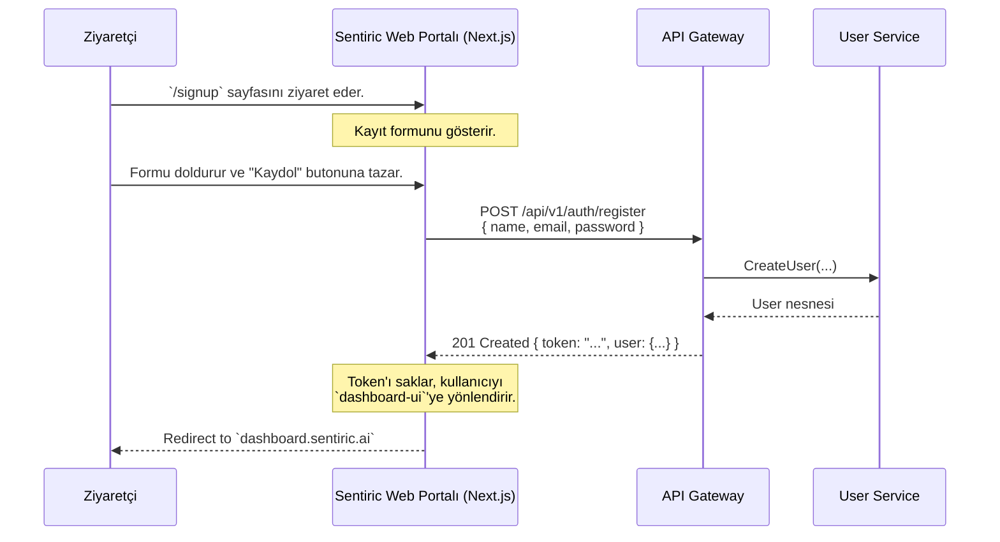

# 🌐 Sentiric Web Portal - Mantık ve Strateji

**Belge Amacı:** Bu doküman, Sentiric'in ana web portalının (`sentiric.ai`) stratejik amacını, hedef kitlelerini, temel bileşenlerini ve platformun geri kalanıyla (özellikle `api-gateway` ve `dashboard-ui`) olan etkileşimini tanımlar.

---

## 1. Stratejik Rol: "Ekosistemin Giriş Kapısı"

Bu web sitesi, projenin sadece bir "vitrini" değil, Sentiric ekosistemine açılan **ana giriş kapısıdır.** Farklı kitlelere farklı yolculuklar sunan çok amaçlı bir portaldır.

**Temel Hedefleri:**
1.  **Değer Önerisini Anlatmak:** Teknik olmayan karar vericilere (CEO, Operasyon Müdürü), Sentiric'in işlerini nasıl dönüştürebileceğini vaka analizleri ve ROI raporları ile anlatmak.
2.  **Müşteri Kazanımı (Acquisition):** Potansiyel müşterilerin platformu risksiz bir şekilde denemelerini (`Sign Up`), fiyatlandırmayı incelemelerini (`Pricing`) ve kurumsal çözümler için iletişime geçmelerini (`Contact Sales`) sağlamak.
3.  **Geliştirici Topluluğu Oluşturmak:** Geliştiricilere, platformun nasıl çalıştığını anlatan detaylı dokümantasyon, API referansları ve SDK'lar sunmak.
4.  **Kullanıcıları Platforma Yönlendirmek:** Mevcut kullanıcıların, hesaplarını yönetmek için `dashboard-ui`'ye giriş yapmalarını sağlamak.

---

## 2. Temel Bileşenler ve Teknoloji Seçimi

Bu portal, hem statik içeriği (pazarlama sayfaları) hızlı bir şekilde sunmalı hem de dinamik (kullanıcı kaydı, login) işlemleri yapabilmelidir. Bu nedenle en uygun teknoloji **Next.js**'dir.

*   **Pazarlama Sayfaları (`/`, `/pricing`, `/solutions`):** Statik Site Üretimi (SSG) ile oluşturulacak. Bu, inanılmaz hız ve SEO avantajı sağlar. İçerikler, `sentiric-governance/docs/marketing/pages` altındaki Markdown dosyalarından otomatik olarak çekilebilir.
*   **Kullanıcı İşlemleri (`/signup`, `/login`):** Sunucu Tarafı Render (SSR) veya İstemci Tarafı Render (CSR) ile `api-gateway` üzerinden `user-service` ile konuşacak dinamik sayfalardır.
*   **Dokümantasyon (`/docs`):** `sentiric-governance` reposundaki tüm dokümanları otomatik olarak çekip sunan, arama özellikli bir portal olacak.
*   **Blog (`/blog`):** Teknik makaleler ve vaka analizleri için.

---

## 3. Uçtan Uca Akış: Yeni Bir Müşterinin Kaydolması

